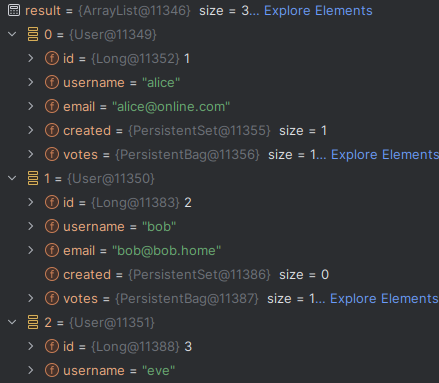

# Expass 2
## Technical Problems
### Development Environment
During the expass1 I did not encounter any problems, however when I started on expass2 I experienced issues with using Visual Studio code, this cause me to switch to InteliJ. The switch took a long time as I had issues with my Java and Gradle as I used WSL to install these. To fix this I had to have the project directory inside the WSL file structure, this fixed the gradle/java problem with InteliJ
### Unsolved
I did not prioritize solving task 6 and 7 due to time constraints caused by development environment issues.
  
# Solved
The task 1-5 is solved and fully tested, I implemented automated testing with jupiter unit testing with RestClient.
Manual testing was done with InteliJ's httpclient.

# Expass 3
See branch, expass3

# Expass 4
## Summary
Did not have many issues except for missing getters/setters that caused problems. Spent longer than I expected doing the intergration. 
Inspected the table by querying in the console with entitymanger

Other than that it went well, all tests passed after a bit of tweaking, did not test frontend, I expect there to be some errors due to changes to API endpoints